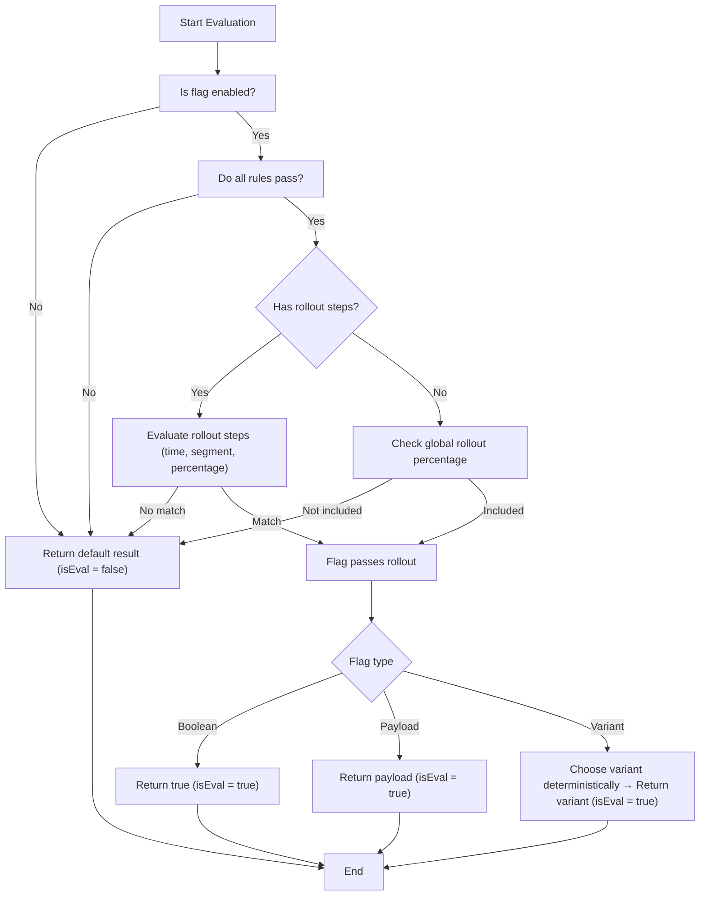

# Flaggly

Flaggly is a lightweight, self-hosted feature flag service running on Cloudflare Workers. Deploy your own worker in minutes with boolean flags, payload flags, A/B testing, and progressive rollouts.

Docs - [flaggly.dev](https://flaggly.dev)

## Deployment

### Service bindings
The worker uses the following service bindings to function. 
1. `FLAGGLY_KV` - [Cloudflare Workers KV](https://developers.cloudflare.com/kv/) - The main database for storing flags.
2. `JWT_SECRET` - [Secret](https://developers.cloudflare.com/workers/configuration/secrets/) - The secret for to sign and verify keys for the API.
3. `ORIGIN` - [Environment variable](https://developers.cloudflare.com/workers/configuration/environment-variables/) - Allowed CORS origin or list of origins which can use the service. Use a comma separated list to allow multiple origins.


### Quick Deploy
The quickest way to get a worker up and running is by using the automatic GitHub integration with Cloudflare Workers. This is the recommended way.

[](https://deploy.workers.cloudflare.com/?url=https://github.com/butttons/flaggly)

The automatic deployment will essentially do the following:
1. Clone the repository in your Github account.
2. Use that to build a project.
3. You can configure the variables, secrets and the project name in the setup. Keep note of the `JWT_SECRET`. You will need it later to generate the JWT tokens.

### Manual Deploy
You need to install the following:
1. pnpm - https://pnpm.io/installation
2. wrangler - https://developers.cloudflare.com/workers/wrangler/install-and-update/
3. node - https://nodejs.org/en/download

Then you can manually deploy your project without connecting it to GitHub.
1. Clone the repository
```sh
git clone https://github.com/butttons/flaggly
```

2. Login with wrangler
```sh
cd flaggly
npx wrangler login
```

3. Setup the KV namespace. You will need to remove the default entry in the `wrangler.json` before you can create this binding with the same name. You can safely remove the entire `kv_namespaces` field. Then use the following command to create a KV store or [use the dashboard to create one](https://developers.cloudflare.com/kv/get-started/#2-create-a-kv-namespace).
```sh
npx wrangler kv namespace create FLAGGLY_KV
```
The command should prompt you to add the configuration to the `wrangler.json`. In case you've created the KV store using the dashboard, copy the ID of the KV store from the dashboard and add the following in `wrangler.json`:
```json
// ...
"kv_namespaces": [
  {
    "binding": "FLAGGLY_KV",
    "id": "[KV_STORE_ID]"
  }
]
// ...
```

4. Setup the `ORIGIN` variable - Update the `vars.ORIGIN` value in the `wrangler.json`

5. Deploy to Cloudflare
```sh
pnpm run deploy
```

6. Set the `JWT_SECRET` via CLI or (with the dashboard)[https://developers.cloudflare.com/workers/configuration/secrets/#via-the-dashboard].
```sh
npx wrangler secret put JWT_SECRET
```

### Updating

Update your worker when a new version is released. Your `wrangler.jsonc` is never overwritten -- all your KV namespace IDs, secrets, and other settings are preserved.

> **Note:** This will discard any local changes except `wrangler.jsonc`. Back up any custom modifications before updating.

#### Using the GitHub Actions workflow (recommended)
1. Go to your worker repo on GitHub
2. Navigate to **Actions** > **Update Worker**
3. Click **Run workflow**
4. Optionally enter a specific version tag (e.g. `v0.0.2`), or leave empty for the latest release
5. The workflow downloads the latest worker code, preserves your `wrangler.jsonc`, and commits the update

#### Manual update
1. Add the upstream remote (first time only)
```sh
git remote add flaggly https://github.com/butttons/flaggly.git
```

2. Backup config, fetch and merge upstream
```sh
cp wrangler.jsonc wrangler.jsonc.bak
git fetch flaggly
git merge -X theirs flaggly/main -m "Update from upstream"
```

3. Restore your config
```sh
cp wrangler.jsonc.bak wrangler.jsonc
rm wrangler.jsonc.bak
```

4. Push and deploy
```sh
git push
```

## Admin UI

Flaggly includes a built-in admin UI for managing flags and segments. It is served at `/app` and protected by HTTP Basic Auth.

- **Username:** `flaggly`
- **Password:** your `JWT_SECRET`

The UI lets you:
- View all flags and segments for any app/environment
- Create, edit, and delete flags (boolean, payload, variant)
- Toggle flags on/off
- Create and delete segments
- Switch between apps and environments

## Configuration
You can interact with your worker once it's deployed. Before proceeding, you will need the following:
1. URL of the worker. You can find this in the `Settings` tab of your worker, under `Domains & Routes`. Here you can also add a custom domain and disable the default worker domain entirely.
2. The JWT keys for the API. You can generate the keys by using the `/__generate` endpoint. By default, it will generate a token with a 6 month expiry. You can create your own longer one at [jwt.io](https://www.jwt.io/) or pass in a valid date string as `expiresAt` field to set the expiry time of the tokens. 

```sh
curl -X POST https://flaggly.[ACCOUNT].workers.dev/__generate \
  -H "Content-Type: application/json" \
  -d '{
    "secret": "[JWT_SECRET]"  
  }'
```
Response
```json
{
  "user": "JWT_STRING",
  "admin": "JWT_STRING"
}
```


All `/admin/*` requests require a Bearer token:
```sh
Authorization: Bearer ADMIN_JWT
```
Additional headers can be used to define the app and environment:
```sh
X-App-Id: default          # defaults to "default"
X-Env-Id: production       # defaults to "production"
```

Use these to manage flags across different apps and environments:

```sh
# Manage staging environment
curl https://flaggly.[ACCOUNT].workers.dev/admin/flags \
  -H "Authorization: Bearer ADMIN_JWT" \
  -H "X-Env-Id: staging"

# Manage different app
curl https://flaggly.[ACCOUNT].workers.dev/admin/flags \
  -H "Authorization: Bearer ADMIN_JWT" \
  -H "X-App-Id: mobile-app" \
  -H "X-Env-Id: production"
```


Now you can interact with the API easily:

### Managing flags:

Get all data
```sh
curl https://flaggly.[ACCOUNT].workers.dev/admin/flags \
  -H "Authorization: Bearer {SERVICE_KEY}"
```
Response
```json
{
  "flags": {
    "new-checkout": { ... },
    "dark-mode": { ... }
  },
  "segments": {
    "beta-users": "'@company.com' in user.email",
    "premium": "user.tier == 'premium'"
  }
}
```

Create / update flag:
Boolean flag:
```sh
curl -X PUT https://flaggly.[ACCOUNT].workers.dev/admin/flags \
  -H "Authorization: Bearer ADMIN_JWT" \
  -H "Content-Type: application/json" \
  -d '{
    "id": "new-checkout",
    "type": "boolean",
    "enabled": true,
    "label": "New Checkout Flow",
    "description": "Redesigned checkout experience"
  }'
```

Variant flag: (A/B test):
```sh
curl -X PUT https://flaggly.[ACCOUNT].workers.dev/admin/flags \
  -H "Authorization: Bearer ADMIN_JWT" \
  -H "Content-Type: application/json" \
  -d '{
    "id": "button-color",
    "type": "variant",
    "enabled": true,
    "variations": [
      { "id": "control", "label": "Blue", "weight": 50, "payload": "#0000FF" },
      { "id": "treatment", "label": "Green", "weight": 50, "payload": "#00FF00" }
    ]
  }'
```

Payload flag:
```sh
curl -X PUT https://flaggly.[ACCOUNT].workers.dev/admin/flags \
  -H "Authorization: Bearer ADMIN_JWT" \
  -H "Content-Type: application/json" \
  -d '{
    "id": "config",
    "type": "payload",
    "enabled": true,
    "payload": {
      "apiUrl": "https://api.example.com",
      "timeout": 5000
    }
  }'
```

Update a flag:
```sh
curl -X PATCH https://flaggly.[ACCOUNT].workers.dev/admin/flags \
  -H "Authorization: Bearer ADMIN_JWT" \
  -H "Content-Type: application/json" \
  -d '{
    "enabled": false,
    "description": "Temporarily disabled"
  }'
```

Delete a flag:
```sh
curl -X DELETE https://flaggly.[ACCOUNT].workers.dev/admin/flags/[FLAG_ID] \
  -H "Authorization: Bearer ADMIN_JWT"
```


### Managing segments
Create / update a segment:
```sh
curl -X PUT https://flaggly.[ACCOUNT].workers.dev/admin/segments  \
  -H "Authorization: Bearer ADMIN_JWT" \
  -H "Content-Type: application/json" \
  -d '{
    "id": "team-users",
    "rule": "'\''@company.com'\'' in user.email"
  }'
```


Delete a segment:
```sh
curl -X DELETE https://flaggly.[ACCOUNT].workers.dev/admin/segments/[SEGMENT_ID]  \
  -H "Authorization: Bearer ADMIN_JWT"
```

### Sync flags
Sync all flags and segments between environments.

```sh
curl -X POST https://flaggly.[ACCOUNT].workers.dev/admin/sync \
  -H "Authorization: Bearer ADMIN_JWT" \
  -H "Content-Type: application/json" \
  -d '{
    "targetEnv": "development",
    "sourceEnv": "production",
    "overwrite": true,
  }'
```

Sync a single flags and all its between environments.

```sh
curl -X POST https://flaggly.[ACCOUNT].workers.dev/admin/sync/[FLAG_ID] \
  -H "Authorization: Bearer ADMIN_JWT" \
  -H "Content-Type: application/json" \
  -d '{
    "targetEnv": "development",
    "sourceEnv": "production",
    "overwrite": true,
  }'
```

## Usage
Once you have your flags ready for use, you can install the client side SDK to evaluate them. This guide assumes this is being set up in the front-end. Server side evaluations are handled a little differently when working with cloudflare workers.
```
pnpm i @flaggly/sdk
```
The SDK uses [nanostores](https://github.com/nanostores/nanostores) to manage the flags' state. 

### Setup
Setup the client:
```ts 
// src/lib/flaggly.ts
import { FlagglyClient } from '@flaggly/sdk';

type Flags = {
  'new-checkout': { type: 'boolean' };
  'button-color': { type: 'variant'; result: string };
  config: { type: 'payload'; result: { apiUrl: string; timeout: number } };
};

export const flaggly = new FlagglyClient<Flags>({
  url: 'BASE_URL',
  apiKey: 'USER_JWT',
});

// Evaluation
const isNewCheckout = flaggly.getBooleanFlag('new-checkout');
const buttonColor = flaggly.getVariant('button-color');
const config = flaggly.getPayloadFlag('config')
```

For react:
```ts
// src/lib/flaggly.ts
import { FlagValueResult, FlagglyClient } from '@flaggly/sdk';
import { useSyncExternalStore } from 'react';

type Flags = {
  'new-checkout': { type: 'boolean' };
  'button-color': { type: 'variant'; result: string };
  config: { type: 'payload'; result: { apiUrl: string; timeout: number } };
};

export const flaggly = new FlagglyClient<Flags>({
  url: 'BASE_URL',
  apiKey: 'USER_JWT',
  lazy: true,
  bootstrap: {
    'new-checkout': false,
    'button-color': '#00FF00'
  }
});

// Called once you have the user info
// flaggly.identify(userId: string, user: unknown);

export const useFlags = () => useSyncExternalStore(flaggly.store.subscribe, flaggly.store.get, flaggly.store.get);

export const useFlag = <K extends keyof Flags>(key: K): FlagValue<Flags[K]> => {
  const data = useFlags();
  return data?.[key].result as FlagValue<Flags[K]>;
};


// Component usage
const isNewCheckout = useFlag('new-checkout');
```

Identifying a user once they log in:
```ts
flaggly.identify(userId: string, user: unknown);
```
This will re-evaluate the flags again and reset the state.

You can disable the flag evaluation on load by passing `lazy: false` to the constructor.

### Server side setup 
You can use the same SDK in backend code too, but if you're using workers you must [use a service binding](https://developers.cloudflare.com/workers/runtime-apis/bindings/service-bindings/http/) to first attach your flaggly worker to your worker and then interact with it.

In your worker's wrangler.jsonc:
```json
 // ...
 "services": [
    {
      "binding": "FLAGGLY_SERVICE",
      "service": "flaggly"
    }
  ]
  //...
```


Now you can pass in the fetch from the worker, in the SDK:
```ts
// src/lib/flaggly.ts
import { FlagglyClient } from '@flaggly/sdk';

type Flags = {
  // 
};

export const createFlaggly = (env: Env) => new FlagglyClient<Flags>({
  url: 'BASE_URL',
  apiKey: 'USER_JWT',
  lazy: true,
  workerFetch: (url, init) => env.FLAGGLY_SERVICE.fetch(url, init) 
});
```

```ts
// src/index.ts
const flaggly = createFlaggly(env);
```

## Examples

### Flag examples

#### Kill switch
Instantly disable a feature without redeploying:
```json
{
  "id": "payments-enabled",
  "type": "boolean",
  "enabled": true,
  "label": "Payment Processing",
  "description": "Master switch for payment processing"
}
```
```ts
if (!flaggly.getBooleanFlag('payments-enabled')) {
  return showMaintenanceMessage();
}
```

#### Gradual rollout
Release a feature to 20% of users, then gradually increase:
```json
{
  "id": "new-dashboard",
  "type": "boolean",
  "enabled": true,
  "rollout": 20,
  "label": "New Dashboard",
  "description": "Redesigned dashboard UI"
}
```

#### A/B test with variants
Test different button colors with weighted distribution:
```json
{
  "id": "cta-button-color",
  "type": "variant",
  "enabled": true,
  "variations": [
    { "id": "control", "label": "Blue (Control)", "weight": 50, "payload": "#0066CC" },
    { "id": "green", "label": "Green", "weight": 25, "payload": "#00AA44" },
    { "id": "orange", "label": "Orange", "weight": 25, "payload": "#FF6600" }
  ]
}
```
```ts
const buttonColor = flaggly.getVariant('cta-button-color');
// User always sees the same color based on their ID
```

#### Remote configuration
Store dynamic configuration without code changes:
```json
{
  "id": "api-config",
  "type": "payload",
  "enabled": true,
  "payload": {
    "timeout": 5000,
    "retries": 3,
    "baseUrl": "https://api.example.com/v2"
  }
}
```

#### Scheduled rollout
Release a feature at a specific time:
```json
{
  "id": "black-friday-sale",
  "type": "boolean",
  "enabled": true,
  "rollouts": [
    { "start": "2024-11-29T00:00:00Z", "percentage": 100 }
  ]
}
```

#### Staged rollout by segment
Roll out to internal users first, then beta users, then everyone:
```json
{
  "id": "new-editor",
  "type": "boolean",
  "enabled": true,
  "segments": ["internal-users", "beta-users"],
  "rollouts": [
    { "start": "2024-01-01T00:00:00Z", "segment": "internal-users" },
    { "start": "2024-01-15T00:00:00Z", "segment": "beta-users" },
    { "start": "2024-02-01T00:00:00Z", "percentage": 100 }
  ]
}
```

### Segment examples

Segments are reusable JEXL expressions that define user groups.

#### Company email domain
Target users with a specific email domain:
```json
{
  "id": "internal-users",
  "rule": "'@company.com' in user.email"
}
```

#### Premium tier users
Target users on paid plans:
```json
{
  "id": "premium-users",
  "rule": "user.tier == 'premium' || user.tier == 'enterprise'"
}
```

#### Geographic targeting
Target users in specific regions (requires geo data from Cloudflare):
```json
{
  "id": "eu-users",
  "rule": "geo.country in ['DE', 'FR', 'IT', 'ES', 'NL']"
}
```

#### Beta opt-in users
Target users who opted into beta features:
```json
{
  "id": "beta-users",
  "rule": "user.betaOptIn == true"
}
```

#### High-value customers
Target users based on multiple conditions:
```json
{
  "id": "high-value",
  "rule": "user.totalSpend > 1000 && user.accountAge > 90"
}
```

## Security

### JWT token management

Flaggly uses two types of JWT tokens:
- **User token** (`flaggly.user`) - For client-side SDK, can only evaluate flags
- **Admin token** (`flaggly.admin`) - For admin API, can create/update/delete flags

Both tokens are signed with your `JWT_SECRET` and have an expiration date.

### Regenerating tokens

If your tokens are compromised or expired, generate new ones:

```sh
curl -X POST https://flaggly.[ACCOUNT].workers.dev/__generate \
  -H "Content-Type: application/json" \
  -d '{
    "secret": "[YOUR_JWT_SECRET]",
    "expireAt": "2025-12-31T23:59:59Z"
  }'
```

This returns new `user` and `admin` tokens. Update your applications with the new tokens.

### Rotating the JWT secret

If your `JWT_SECRET` is compromised, you must rotate it:

1. **Generate a new secret** (minimum 32 characters):
```sh
openssl rand -base64 32
```

2. **Update the secret in Cloudflare**:
```sh
npx wrangler secret put JWT_SECRET
# Enter your new secret when prompted
```
Or update via the [Cloudflare dashboard](https://developers.cloudflare.com/workers/configuration/secrets/#via-the-dashboard).

3. **Generate new tokens** with the new secret:
```sh
curl -X POST https://flaggly.[ACCOUNT].workers.dev/__generate \
  -H "Content-Type: application/json" \
  -d '{
    "secret": "[NEW_JWT_SECRET]"
  }'
```

4. **Update all applications** with the new tokens.

> **Note:** Rotating the secret immediately invalidates ALL existing tokens. Plan for a brief service interruption or coordinate the update across your applications.

### Technical details

#### Architecture
Flaggly runs as a single Cloudflare Worker with these components:
- **KV Storage** - All flags and segments for an app/environment are stored as a single JSON entry in Cloudflare KV. Key format: `v1:{appId}:{envId}`
- **Evaluation Engine** - Uses [JEXL](https://github.com/TomFrost/jexl) for rule expressions with custom transforms (`split`, `lower`, `upper`) and functions (`ts()`, `now()`)
- **Deterministic Hashing** - FNV-1a 32-bit hash ensures consistent flag evaluations across requests

#### The importance of `id`
The `id` field passed during evaluation is critical for consistent user experiences:

```ts
flaggly.identify(userId, { email: user.email, tier: user.tier });
```

This `id` is combined with the flag key to create a deterministic hash:
- **Percentage rollouts**: A user with `id: "user-123"` will always be in the same rollout bucket for a given flag
- **A/B test variants**: The same user always sees the same variant, ensuring consistent experiences
- **Cross-session consistency**: Even without cookies, the same `id` produces the same results

For anonymous users, generate a stable ID (e.g., fingerprint or localStorage UUID) to maintain consistency.

#### Data model
All flags are stored in a single KV entry per app/environment in this shape:

```ts

type AppData = {
	flags: Record<string, FeatureFlag>;
	segments: Record<string, string>;
};

type FeatureFlag = {
	id: string;
	segments: string[];
	enabled: boolean;
	rules: string[];
	rollout: number;
	rollouts: {
		start: string;
		percentage?: number;
		segment?: string;
	}[];
	label?: string;
	description?: string;
  isTrackable?: boolean
} & (
	| {
			type: "boolean";
	  }
	| {
			type: "payload";
			payload: unknown;
	  }
	| {
			type: "variant";
			variations: {
				id: string;
				label: string;
				weight: number;
				payload?: unknown;
			}[];
	  }
);

```

How flag evaluations work:


